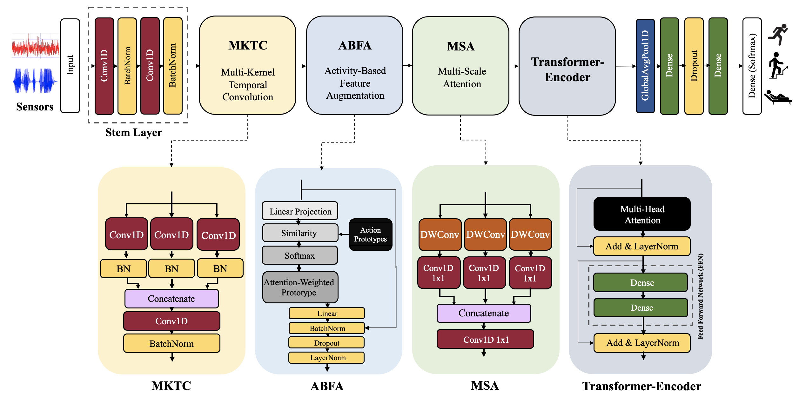

# ABFA_HAR
**(paper source) Action-Prototype Guided Temporal Modeling for Human Activity Recognition (https://github.com/lky473736/ABFA-HAR.git)**


<p align="center"></p>

This repository implements the methodology proposed in the paper "Action-Prototype Guided Temporal Modeling for Human Activity Recognition".

## Datasets

The system works with four popular HAR datasets.

1. **UCI HAR Dataset**: Contains data from smartphone sensors for 6 activities.
   - Download: https://archive.ics.uci.edu/ml/datasets/human+activity+recognition+using+smartphones

2. **WISDM Dataset**: Contains accelerometer data from smartphones for 6 physical activities.
   - Download: https://www.cis.fordham.edu/wisdm/dataset.php

3. **PAMAP2 Dataset**: Physical Activity Monitoring dataset with data from 18 different physical activities. (At this 12.)
   - Download: https://archive.ics.uci.edu/ml/datasets/pamap2+physical+activity+monitoring

4. **mHealth Dataset**: Contains data from body-worn sensors for 12 physical activities.
   - Download: https://archive.ics.uci.edu/ml/datasets/mhealth+dataset

Once downloaded, place each dataset in the appropriate directory under `./data/` as specified in the `config.py` file.

## Directory Structure

```
ABFA-HAR/
├── config.py                # Configuration parameters
├── train.py                 # Main entry point for training model
├── data/                    # Directory for datasets
│   ├── UCI_HAR_Dataset/
│   ├── WISDM_ar_v1.1/
│   ├── PAMAP2_Dataset/
│   └── MHEALTHDATASET/
├── data_parsing/            # Dataset handlers
│   ├── __init__.py
│   ├── base_dataset.py
│   ├── UCI_HAR.py
│   ├── WISDM.py
│   ├── PAMAP2.py
│   └── mHealth.py
├── models/                  # Model architecture
│   ├── __init__.py
│   └── model.py
├── utils/                   # Utility functions
│   ├── __init__.py
│   ├── logger.py
│   ├── metrics.py
│   └── visualization.py
└── testing/                 # Output directory for experimental results
```

## Requirements

The following libraries are required:

```
tensorflow>=2.10.0
numpy>=1.21.0
pandas>=1.3.0
scikit-learn>=1.0.0
matplotlib>=3.5.0
seaborn>=0.11.0
colorama>=0.4.4
umap-learn>=0.5.0
scipy>=1.7.0
imbalanced-learn>=0.9.0
```

You can install all required packages using:

```bash
pip install -r requirements.txt
```

## About ABFA (Action Based Feature Augmentation)

<p align="center"></p>

The process begins with an Input Feature, which is projected to a new space as 
𝑋
proj
X 
proj
​
 . This projected feature is then used to compute attention scores in relation to a Prototype Set 
𝑃
P. A Softmax operation is applied to generate attention weights, which are used to compute a weighted sum over the prototype set—referred to as Attention-Weights Sum.

These attention weights are then passed along with the projected input to an Attention-Weights module, which integrates this information. The result, along with the original input feature, flows into a normalization and regularization block composed of Batch Normalization (BN), Dropout, and Layer Normalization (LayerNorm).

Finally, this produces an Enhanced Feature, which is a more informative and contextually aware representation of the original input, enriched through the use of prototype-based attention.

The ABFA model implements a sophisticated architecture with:
- Action-Prototype guidance for temporal modeling
- Temporal Convolutional Network (TCN) blocks for local feature extraction
- Bidirectional GRU layers for capturing sequential dependencies
- Attention mechanisms for focusing on important temporal patterns
- Prototype learning for better activity classification

## Citing this Repository

If you use this code in your research, please cite:

```
@article{lim2025ABFA,
  title={Action-Prototype Guided Temporal Modeling for Human Activity Recognition},
  author={Gyuyeon Lim and Myung-Kyu Yi}
  journal={},
  volume={},
  Issue={},
  pages={},
  year={}
  publisher={}
}
```

## Contact

For questions or issues, please contact:
- Gyuyeon Lim : lky473736@gmail.com

## License

This project is licensed under the MIT License - see the [LICENSE](LICENSE) file for details.
